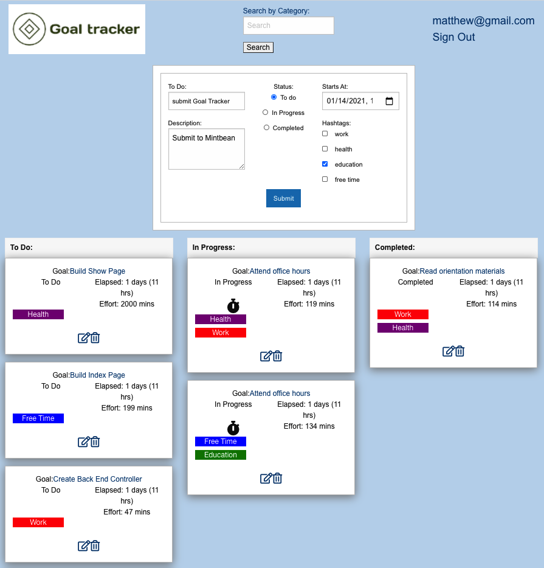

## GOAL-TRACKER

Goal-Tracker is a responsive web application to help people accomplish change and progression in their life by achieving goals. 

Goal-Tracker's front-end is built with JavaScript and React, and the back end is Rails, Ruby and PostgreSQL.  We used Devise for Authentication and Authorization.

There are full authentication flows.

## Demo Note
You need to be signed in to run the application.
To see demo data, sign in with matthew@gmail.com  password: testtest.
You may also create your own credentials.

[See the deployed application on Heroku](https://goal-tracker-222.herokuapp.com/)

## Screen shot
# 

## Preview Demo
# 

## Developers
- Ted Francis
- Jeff Korenstein
- Mark Longchamps

## Built with
- [Ruby on Rails](https://guides.rubyonrails.org/v5.2/)
- [React.js](https://reactjs.org/docs/getting-started.html)
- [PostgreSQL](https://www.postgresql.org/docs/13/index.html)
- [Foundation](https://get.foundation/)

## Run Locally
The setup steps expect the following tools/versions:
- Ruby 2.7.1
- Rails 5.2.3
- PostgreSQL 13

###### Clone the Repo
```
git clone 
```
###### Install Dependencies
```
yarn install 
bundle install 
```

###### Create and seed the database
```
bundle exec rake db: migrate
bundle exec rake db: seed
```

###### Run the test suite
```
bundle exec rspec
```
###### Start the Rails server and webpack-dev-server
```
bundle exec rails s
yarn run start
```

###### The application can be accessed locally at <http://localhost:3000>

